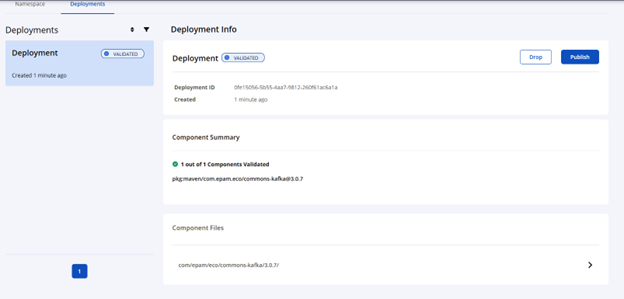
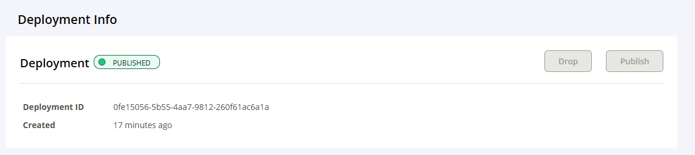

[Official guide from Central Maven](https://central.sonatype.org/publish/publish-portal-maven/)

### How to upload artifact to Central Sonatype repository for Maven Central promoting

  1. [Configure PGP](https://central.sonatype.org/pages/working-with-pgp-signatures.html)
  2. Update your maven settings.xml with valid values (See settings.xml for the quick help).
  3. `mvn release:clean release:prepare`.
  4. After successful run you will be able to find tag in the vcs for new version of your artifact.
  4. `mvn release:perform`.
  5. After successful run you will be able to find your artifact in the [Central Sonatype repository](https://central.sonatype.com/publishing/deployments).
  6. Because of default`<autoPublish>false</autoPublish>` for `central-publishing-maven-plugin` 
  you will see 2 buttons `Drop` and `Publish`, pay attention that Maven Central Release can't be 
     undone.
  and only then press the `Publish`. 
     `Drop` button simply delete your artifact from
     [Central Sonatype repository](https://central.sonatype.com/publishing/deployments). If you feel confidence you can just set
  `<autoPublish>true</autoPublish>` for `central-publishing-maven-plugin`, in this situation 
   release to the Maven Central will be performed automatically without extra steps with buttons (`Publish`, `Drop`).
  
   7. The published versions will be available at [commons-kafka/versions](https://central.sonatype.com/artifact/com.epam.eco/commons-kafka/versions).
### Notes

[SNAPSHOT deployments repository](https://central.sonatype.org/publish/publish-portal-snapshots/)

### publish via rest
printf "username:pwd" | base64

-- check if published
curl --request GET \
--header 'Authorization: Bearer #{base64}' \
'https://central.sonatype.com/api/v1/publisher/published?namespace=com.epam.eco&name=commons-kafka&version=3.0.8'

-- publish by deployment id (get from mvn release)
curl --request POST \
--verbose \
--header 'Authorization: Bearer #{base64}' \
'https://central.sonatype.com/api/v1/publisher/deployment/4de791fd-2952-4e56-a561-e4fef48d0638'

-- check publishing status by deployment id (get from mvn release)
curl --request POST \
--header 'Authorization: Bearer #{base64}' \
'https://central.sonatype.com/api/v1/publisher/status?id=4de791fd-2952-4e56-a561-e4fef48d0638'

-- check artifact exists in mvn central
wget https://repo1.maven.org/maven2/com/epam/eco/commons-kafka/3.0.8/commons-kafka-3.0.8.jar